# Chapter 10: Optics 架构揭秘

前九章你一直在使用 `update`、`ifPresent`、`updateElements` 这些 API。它们工作得不错，但你有没有想过：为什么 `UNIT.update(MyConfig::port, v -> v + 1)` 能精确修改 `Record` 中的某个字段，而不影响其他字段？为什么 `ifPresent` 能在值为空时自动跳过？

**核心问题**：一个方法引用 `MyConfig::port` 只是一段指向 getter 的 lambda，它本身只能"读"，不能"写"。OELib Config 是如何从这样一个只能读的 getter 中，提取出字段名，然后构造出一对可读可写的指针，进而实现不可变 Record 的字段级更新的？

答案是一套 **Optics（光学）** 体系。本章将通过逐行代入 Java 泛型类型的方式，揭示这套体系的工作原理。

---

## 10.1 Lens：从方法引用到字段指针

### 10.1.1 问题：getter 只能读，不能写

假设有如下配置 Record：

```java
public record MyConfig(int port, String host) {}
```

用户写出 `MyConfig::port` 时，Java 编译出一个方法引用。这个引用只能做一件事：传入 `MyConfig` 返回 `Integer`。它无法产生"将 port 改为新值后的新 MyConfig"。

**我们需要把 `S -> A` 扩展为一对 `(S -> A, (A, S) -> S)` ———— 一个能读也能写的双向指针。**

### 10.1.2 源码实现：ConfigLens

```java
public final class ConfigLens<S, A> {
    private final Function<S, A> viewFn;       // S -> A, 读取
    private final BiFunction<A, S, S> setFn;   // (A, S) -> S, 写入（重建）

    public A view(S source) { return viewFn.apply(source); }
    public S set(S source, A value) { return setFn.apply(value, source); }
    public S update(S source, UnaryOperator<A> updater) {
        return setFn.apply(updater.apply(viewFn.apply(source)), source);
    }
}
```

两个类型参数：`S`（源类型，即 Record 类型），`A`（目标字段类型）。两个核心函数：
- `viewFn`：从 `S` 中取出 `A`
- `setFn`：给定新的 `A` 值，将其"写回" `S`，返回全新的 `S`

所谓"写回"，对于不可变的 Record 来说，就是**重建**：构造一个除了目标字段外其他字段完全相同的新 Record。

### 10.1.3 泛型代入：具体化到 MyConfig

当 `RecordLensBuilder.lens(MyConfig.class, MyConfig::port)` 被调用时，泛型参数被推导为：

```
ConfigLens<MyConfig, Integer>
    viewFn:  MyConfig           -> Integer
    setFn:  (Integer, MyConfig) -> MyConfig
```

即：

```mermaid
graph LR
    subgraph viewFn[S -> A]
        S["MyConfig (源 Record)"] --> A["Integer (port 字段值)"]
    end
    subgraph setFn[(A, S) -> S]
        V["新 Integer 值"] --- S2["MyConfig (源)"] --> NEW["新的 MyConfig"]
    end
```

如果用伪代码表达 setFn 的内部逻辑，相当于：

```java
// setFn 等价于:
(Integer newPort, MyConfig old) -> new MyConfig(newPort, old.host())
```

目标字段使用新值，其余字段从旧 Record 逐项拷贝。这正是不可变 Record 的"修改"方式————没有就地修改，只有重建。

### 10.1.4 生成过程：从 getter 方法引用到 Lens

`RecordLensBuilder` 做了三件事：

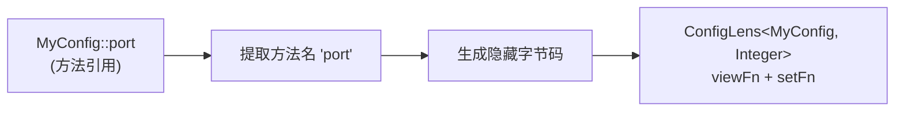

**第一步：提取字段名**

```java
// RecordLensBuilder.extractComponentName
SerializedLambda lambda = ...;
return lambda.getImplMethodName(); // 返回 "port"
```

通过序列化机制，将方法引用拆解为 `SerializedLambda`，从中读取出 `implMethodName`，即 Record 组件名称。

**第二步：按名称索引查找 RecordComponent**

```java
RecordComponent[] components = recordClass.getRecordComponents();
// 遍历找到 name == "port" 的那个，记录其索引
```

**第三步：生成零反射字节码**

`RecordLensClassGenerator` 使用 Class-File API 为每个 Record 组件生成一个隐藏类，内建两个静态方法：

```java
// 生成的 view 方法 — 等效于:
static Integer view(MyConfig source) { return source.port(); }

// 生成的 update 方法 — 等效于:
static MyConfig update(Integer newPort, MyConfig source) {
    return new MyConfig(newPort, source.host());
}
```

这两个方法通过 `invokevirtual`（读）和 `invokespecial`（构造）实现，**完全不使用 `Method.invoke` 反射**，性能接近手写代码。

生成的隐藏类被注册为 Nestmate，通过 `MethodHandle` 调用，最终包装为 Lambda 存入 `ConfigLens` 的 `viewFn` 和 `setFn`。

---

## 10.2 Compose：从单字段到嵌套字段

### 10.2.1 问题：嵌套 Record 需要多步聚焦

真实配置很少是扁平的，更常见的是嵌套结构：

```java
public record DatabaseConfig(String host, int port) {}
public record AppConfig(String name, DatabaseConfig database) {}
```

要读取 `AppConfig.database.host`，手动做法是：先读 `database`，再读 `host`。但我们希望一次组合，得到直通根到叶的 Lens。

### 10.2.2 泛型代入：两个 Lens 组合

定义两个 Lens：

```java
ConfigLens<AppConfig, DatabaseConfig> dbLens
    = RecordLensBuilder.lens(AppConfig.class, AppConfig::database);
// dbLens: viewFn = AppConfig -> DatabaseConfig
//         setFn  = (DatabaseConfig, AppConfig) -> AppConfig

ConfigLens<DatabaseConfig, String> hostLens
    = RecordLensBuilder.lens(DatabaseConfig.class, DatabaseConfig::host);
// hostLens: viewFn = DatabaseConfig -> String
//          setFn  = (String, DatabaseConfig) -> DatabaseConfig
```

调用 `dbLens.compose(hostLens)`，返回 `ConfigLens<AppConfig, String>`。

**中间类型约束**：`hostLens` 的源类型 `DatabaseConfig` 必须等于 `dbLens` 的目标类型 `DatabaseConfig`。这是 Java 泛型在编译期的检查：`ConfigLens<A, B>.compose(ConfigLens<B, C>)` ———— 中间类型 `B` 必须完全一致。

### 10.2.3 源码实现：compose 方法

```java
public <B> ConfigLens<S, B> compose(ConfigLens<A, B> child) {
    // ...
    return new ConfigLens<>(
        path + "." + child.path,                      // 路径: "database.host"
        source -> child.view(view(source)),            // view: 先取 database, 再取 host
        (value, source) -> set(source, child.set(view(source), value))  // set: 从内向外重建
    );
}
```

**代入具体类型**：当 `S = AppConfig, A = DatabaseConfig, B = String`：

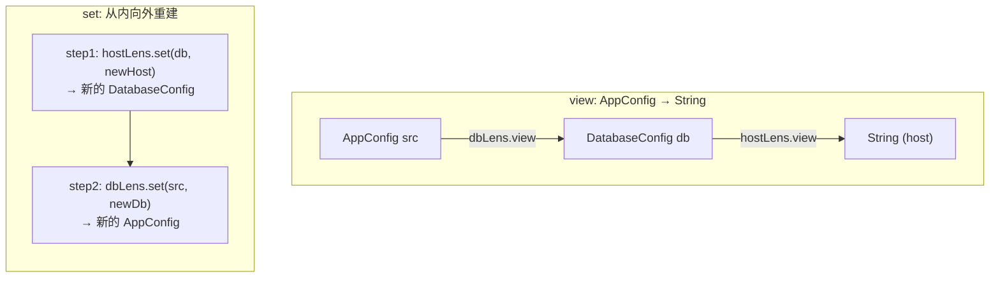

组合后的 `set` 采用**从内向外逐层重建**机制：

1. `hostLens.set(view(source), value)`：用新值替换 `DatabaseConfig` 中的 `host`，产生新的 `DatabaseConfig`
2. `set(source, newDb)`：将新的 `DatabaseConfig` 替换回 `AppConfig`，产生新的 `AppConfig`

这种嵌套重建保证了**中间层 Record 的未改字段完全不受影响**————`DatabaseConfig` 中的 `port` 保持不变，`AppConfig` 中的 `name` 也保持不变。

---

## 10.3 ConfigAffine：可空条件访问器

### 10.3.1 问题：Optional 字段为空时怎么办

```java
public record MyConfig(Optional<Integer> maxPlayers, String host) {}
```

当 `maxPlayers` 为 `Optional.empty()` 时，`Lens.view()` 会返回空 Optional。但用户想要的效果是：**如果值为空，跳过不处理**。普通的 Lens 不具备这种"条件判断"能力。

### 10.3.2 为什么不是 Prism，而是 Affine

在标准光学理论中，**Prism** 和 **Affine** 的区别在于一个关键操作：

- **Prism**：`preview` (S → Optional<A>) + **`review`** (A → S)。能从焦点值 **构造** 出完整的源。适用于**和类型（sum types）**的模式匹配。
- **Affine**（又名 AffineTraversal）：`preview` (S → Optional<A>) + **`set`** (S × A → S)。能 **读取**（可能失败）和 **更新**，但 **不能从焦点构造出整体** —— 更新时必须传入旧的源。

我们的类只有 `preview` + `set`，没有 `review`（给定一个 `Integer`，无法凭空构造出 `MyConfig`），因此是 **Affine**，不是 Prism。

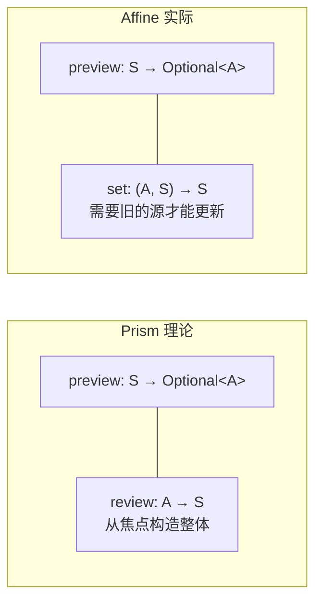

### 10.3.3 源码实现：ConfigAffine

```java
public final class ConfigAffine<S, A> {
    private final Function<S, Optional<A>> preview;  // S -> Optional<A>
    private final BiFunction<A, S, S> setter;         // (A, S) -> S

    public Optional<A> preview(S source) {
        return preview.apply(source);                 // 可能为空
    }

    public S updateIfPresent(S source, UnaryOperator<A> updater) {
        Optional<A> matched = preview(source);
        if (matched.isEmpty()) {
            return source;                            // 不匹配，原样返回
        }
        return set(source, updater.apply(matched.get()));
    }
}
```

与 Lens 的关键区别：

| 操作 | Lens | Affine |
|---|---|---|
| 读取 | `view(S)` → **总是**返回 `A` | `preview(S)` → 返回 `Optional<A>` |
| 条件更新 | 无 | `updateIfPresent` → 不匹配时跳过 |

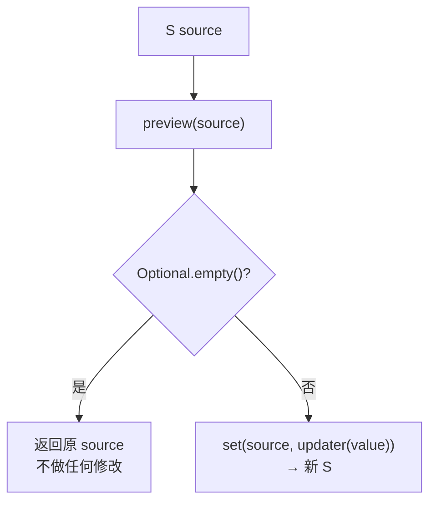

### 10.3.4 泛型代入：从 Optional 字段到 Affine

`RecordLensBuilder.optional()` 将一个指向 `Optional<A>` 的 Lens 包装为 Affine：

```java
// 假设:
ConfigLens<MyConfig, Optional<Integer>> optLens = ...;  // 指向 maxPlayers

// 包装为 Affine:
ConfigAffine<MyConfig, Integer> affine =
    RecordLensBuilder.optional(optLens);
```

代入泛型 `S = MyConfig, A = Integer`：

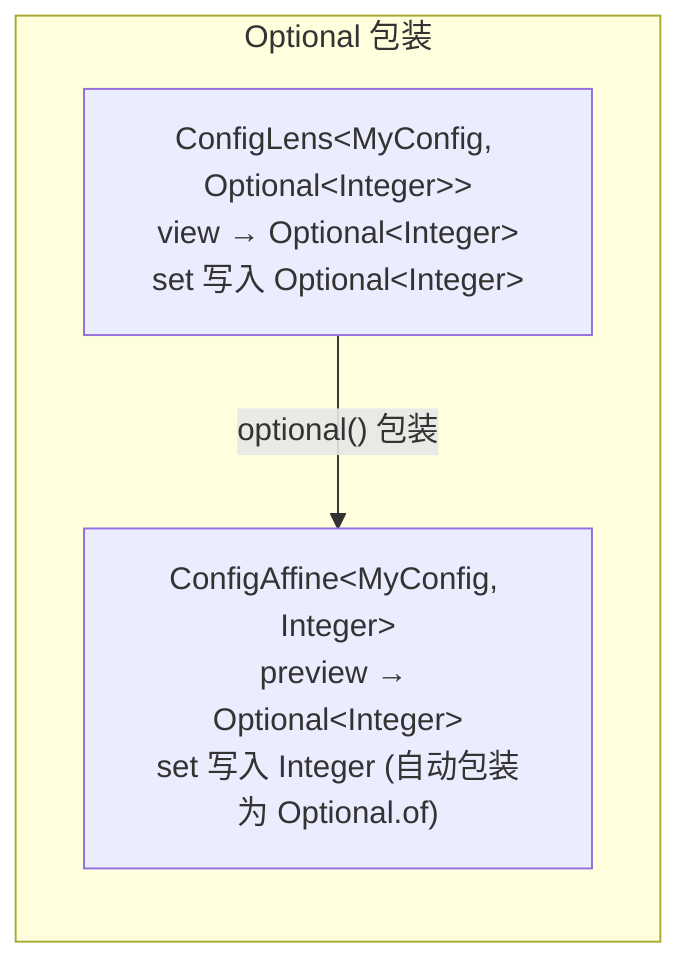

源码中 `optional()` 的实现体现出这种含义转换：

```java
public static <S, A> ConfigAffine<S, A> optional(ConfigLens<S, Optional<A>> lens) {
    return new ConfigAffine<>(
        lens.path(),
        lens::view,               // preview = 直接沿用 view, 返回 Optional<A>
        (value, source) -> lens.set(source, Optional.ofNullable(value))  // setter = 自动包装为 Optional
    );
}
```

`preview` 直接复用 Lens 的 `view`（它本来就返回 `Optional<A>`），`setter` 负责将裸值 `A` 重新包装为 `Optional.ofNullable(value)` 后再写回。

注意这里只有 `set` 没有 `review`：给定一个 `Integer` 无法构造出 `MyConfig`，必须同时有旧的 `MyConfig` 源。这正是 Affine 而非 Prism 的特征。

### 10.3.5 子类型 Affine

类似地，密封类型场景也会用到 Affine：

```java
public sealed interface Mode permits ModeA, ModeB {}
public record Config(Mode mode) {}

ConfigLens<Config, Mode> modeLens = ...;
ConfigAffine<Config, ModeA> aAffine =
    RecordLensBuilder.subtype(modeLens, ModeA.class);
```

此时 `preview` 的语义是：如果运行时类型是 `ModeA` 则匹配，否则返回空：

```java
// subtype() 源码:
source -> {
    A value = lens.view(source);
    if (subtypeClass.isInstance(value)) {
        return Optional.of(subtypeClass.cast(value));
    }
    return Optional.empty();
}
```

这里同样没有 `review`：给定一个 `ModeA` 无法构造出 `Config`（不知道 `Config` 还需要什么其他字段），因此只能是 Affine。

---

## 10.4 Traversal：集合中的多焦点聚焦

### 10.4.1 问题：如何批量更新 List 中的每个元素

```java
public record MyConfig(List<String> whitelist, Map<String, Integer> limits) {}
```

要对 `whitelist` 中的每个 `String` 应用变换，手写循环可以，但如何将这个操作也纳入 Optics 的统一框架？我们需要一种能"同时聚焦多个元素"的 Optic。

### 10.4.2 源码实现：ConfigTraversal

```java
public final class ConfigTraversal<S, A> extends ConfigFold<S, A> {
    private final BiFunction<S, UnaryOperator<A>, S> updateAll;

    public S update(S source, UnaryOperator<A> modifier) {
        return updateAll.apply(source, modifier);
    }
}
```

`Traversal` 的能力用一句话概括：**给定一个 `S -> A` 方向上的批量变换函数 `UnaryOperator<A>`，沿着 `S -> [A]` 的路径分发到每个元素，再聚合成新的 `S`**。

### 10.4.3 泛型代入：List 元素遍历

`Traversals.onList` 将一个指向 `List<T>` 字段的 Lens 转化为遍历其中每个元素的 Traversal：

```java
// 假设 lens = ConfigLens<MyConfig, List<String>>, 指向 whitelist
ConfigTraversal<MyConfig, String> t = Traversals.onList(lens);
```

代入 `S = MyConfig, T = String`：

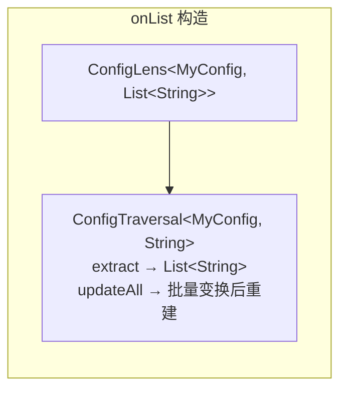

源码实现：

```java
public static <S, T> ConfigTraversal<S, T> onList(ConfigLens<S, List<T>> lens) {
    return new ConfigTraversal<>(
        lens.path(),
        source -> List.copyOf(lens.view(source)),     // extract: 读出 List, 返回不可变副本
        (source, op) -> lens.set(source,               // updateAll: 取出 -> 映射 -> 写回
            lens.view(source).stream()
                .map(op)
                .collect(Collectors.toList()))
    );
}
```

**执行流程**：

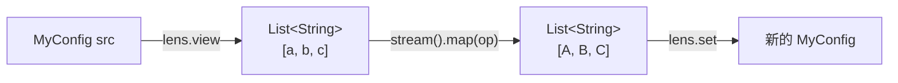

每次 `update` 都会产生一个全新的 List 实例（通过 `stream().map().collect()`），再通过 `lens.set` 写回，整个过程不可变。

### 10.4.4 Map 值遍历

`Traversals.onMapValues` 类似，但保留 Map 的键结构：

```java
public static <S, K, V> ConfigTraversal<S, V> onMapValues(ConfigLens<S, Map<K, V>> lens) {
    return new ConfigTraversal<>(
        lens.path(),
        source -> List.copyOf(lens.view(source).values()),
        (source, op) -> {
            Map<K, V> map = lens.view(source);
            Map<K, V> result = new LinkedHashMap<>(map.size());
            for (Map.Entry<K, V> entry : map.entrySet()) {
                result.put(entry.getKey(), op.apply(entry.getValue()));
            }
            return lens.set(source, result);
        }
    );
}
```

注意 `extract` 只暴露值（丢掉键），但 `updateAll` 会遍历 `entrySet()`，**保留键结构不变，只变换值**。

---

## 10.5 Fold：只读的多焦点提取

### 10.5.1 与 Traversal 的关系

`ConfigFold` 是 `ConfigTraversal` 的父类，也是其**只读版本**：

```
ConfigFold<S, A>      — extract(S) → List<A> , 只有读取能力
    ↑ 继承
ConfigTraversal<S, A> — + updateAll(S, UnaryOperator<A>) → S , 增加写入能力
```

### 10.5.2 源码：查询操作

```java
public class ConfigFold<S, A> {
    private final Function<S, List<A>> extractFn;

    public List<A> extract(S source) { return extractFn.apply(source); }

    public long count(S source)           { return extract(source).size(); }
    public boolean anyMatch(S source, Predicate<? super A> p) { ... }
    public boolean allMatch(S source, Predicate<? super A> p) { ... }
    public <R> R fold(S source, R identity, BiFunction<R, ? super A, R> acc) { ... }
}
```

### 10.5.3 泛型代入：Map 键的只读提取

```java
// 构造一个只读 Fold: 提取 Map 的所有键
ConfigLens<MyConfig, Map<String, Integer>> lens = ...;
ConfigFold<MyConfig, String> keyFold = Folds.onMapKeys(lens);
```

代入 `S = MyConfig, K = String`：

```
Folds.onMapKeys:  ConfigLens<MyConfig, Map<String, Integer>>
              →  ConfigFold<MyConfig, String>
              →  extractFn = MyConfig -> List<String> (map 的 keySet)
```

`Folds.onMapKeys` 的实现：

```java
public static <S, K, V> ConfigFold<S, K> onMapKeys(ConfigLens<S, Map<K, V>> lens) {
    return new ConfigFold<>(
        lens.path(),
        source -> List.copyOf(lens.view(source).keySet())
    );
}
```

只读意味着不能在查询上下文中意外修改配置，这是一层编译期的安全边界。

---

## 10.6 Composition：类型安全性下的组合规则

四种 Optics 可以相互组合，组合结果由**焦点数量的乘积**决定。

### 10.6.1 compose 方法的多态

每种 Optic 的 `compose` 都遵循一个模式：**组合后的焦点数 = 左焦点数 × 右焦点数**。

| 组合 | 左焦点 | 右焦点 | 结果焦点 | 结果类型 |
|---|---|---|---|---|
| `Lens.compose(Lens)` | 1 | 1 | 1 | Lens |
| `Traversal.compose(Lens)` | 0..N | 1 | 0..N | Traversal |
| `Traversal.compose(Traversal)` | 0..N | 0..N | 0..N | Traversal |
| `Fold.compose(Lens)` | 0..N | 1 | 0..N | Fold |
| `Fold.compose(Traversal)` | 0..N | 0..N | 0..N | Fold |

**Lens + Affine** 呢？由于 `ConfigLens` 没有与 `ConfigAffine` 直接组合的方法，这种组合发生在业务层：当用户通过 `ConfigUnit.ifPresent()` 传入 getter 时，内部先构造 Lens，再包装为 Affine，再调用 `affine.updateIfPresent`。

### 10.6.2 代入示例：Traversal + Lens

```java
// 假设嵌套 List: record Config(List<DatabaseConfig> databases) {}
// 目标: 对每个 database 的 host 字段做变换

ConfigLens<Config, List<DatabaseConfig>> dbListLens = ...;
ConfigLens<DatabaseConfig, String> hostLens = ...;

ConfigTraversal<Config, DatabaseConfig> dbTraversal = Traversals.onList(dbListLens);
ConfigTraversal<Config, String> hostTraversal = dbTraversal.compose(hostLens);
```

`compose` 的实现：

```java
public <B> ConfigTraversal<S, B> compose(ConfigLens<A, B> lens) {
    return new ConfigTraversal<>(
        path() + "." + lens.path(),                     // 路径拼接
        source -> {                                      // extract: 展平
            List<A> as = extract(source);                // 先取 List<DatabaseConfig>
            List<B> bs = new ArrayList<>(as.size());
            for (A a : as) {
                bs.add(lens.view(a));                    // 再取每个的 host
            }
            return bs;
        },
        (source, op) -> updateAll.apply(source,          // updateAll: 逐层下发
            a -> lens.set(a, op.apply(lens.view(a))))
    );
}
```

**代入具体类型后**：

```
extract: Config → List<DatabaseConfig> → 对每个 DatabaseConfig.view(host) → List<String>
updateAll: 对每个 DatabaseConfig, 执行 hostLens.set → 产生新 DatabaseConfig → 写回 List
```

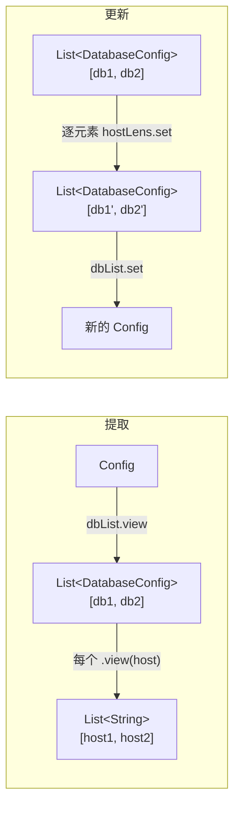

---

## 10.7 ConfigMutation：从 Optics 到提交层的桥梁

### 10.7.1 问题：Optics 只是变换工具，不负责持久化

Lens 能精确修改字段，Affine 能条件跳过，Traversal 能批量更新。但它们只关注**数据变换**，不关心**何时写入磁盘、如何校验、是否发布事件**。我们需要一个中间结构，将 Optics 的变换能力封装为纯数据变换，再交给 `ConfigUnit` 做 IO。

### 10.7.2 源码：ConfigMutation 就是一个 S -> S

```java
@FunctionalInterface
public interface ConfigMutation<S> {
    S apply(S source);
}
```

它的本质就是 **旧配置 → 新配置** 的纯函数。

**Optics 到 Mutation 的转换**：

```java
// ConfigLens 中:
public ConfigMutation<S> setTo(A value) {
    return source -> set(source, value);    // 闭包捕获 value
}

public ConfigMutation<S> map(UnaryOperator<A> updater) {
    return source -> update(source, updater);  // 闭包捕获 updater
}

// ConfigTraversal 中:
public ConfigMutation<S> toMutation(UnaryOperator<A> modifier) {
    return source -> update(source, modifier);  // 闭包捕获 modifier
}
```

每一个 Mutation 都是一个闭包，捕获了之前构造好的 Lens/Affine/Traversal 和一个变换函数，在调用时执行实际的数据变换。

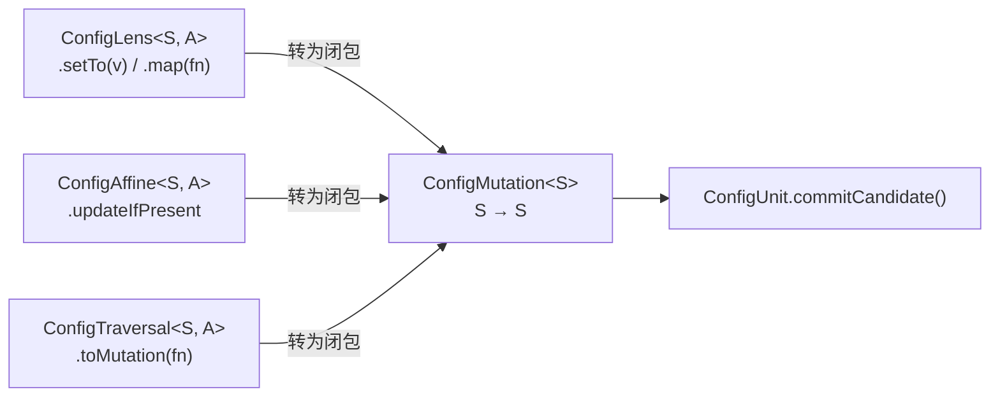

### 10.7.3 批量提交：updateAll

多个 Mutation 可以组合：

```java
UNIT.updateAll(
    ConfigMutation.set(MyConfig::port, 8080),
    ConfigMutation.map(MyConfig::host, String::toLowerCase)
);
```

`updateAll` 内部逐次应用每个 Mutation（通过 `mutation.apply(updated)`），最后一次性调用 `commitCandidate`。这意味着**多个字段修改只需要一次校验、一次 IO、一次事件发布**。

---

## 10.8 ConfigUnit：业务 API 背后的 Optics 三部曲

### 10.8.1 全景：每个业务 API 的完整调用链路

现在让我们回到开头的问题：`UNIT.update(MyConfig::port, v -> v + 1)` 内部发生了什么？

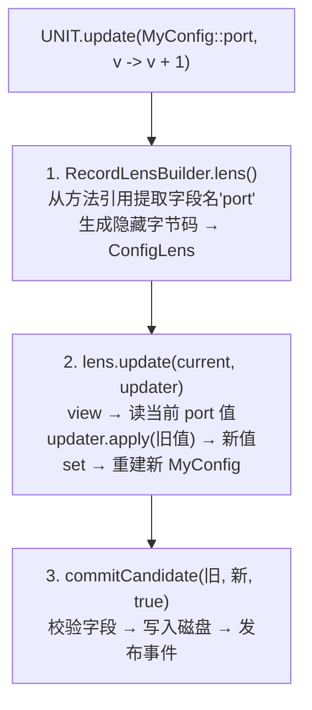

**这就是 Optics 三部曲：定位 → 变换 → 提交**。

### 10.8.2 从业务 API 到 Optics 的映射

| 业务 API | 定位阶段 | 变换阶段 | 提交阶段 |
|---|---|---|---|
| `UNIT.update(g, m)` | `Lens` = 从 getter 创建 | `lens.update(current, m)` | `commitCandidate` |
| `UNIT.ifPresent(g, m)` | `Lens` → `Affine.optional` | `affine.updateIfPresent(current, m)` | `commitCandidate` |
| `UNIT.ifPresent(g, cls, m)` | `Lens` → `Affine.subtype` | `affine.updateIfPresent(current, m)` | `commitCandidate` |
| `UNIT.updateElements(g, m)` | `Lens` → `Traversals.onList` | `traversal.update(current, m)` | `commitCandidate` |
| `UNIT.updateValues(g, m)` | `Lens` → `Traversals.onMapValues` | `traversal.update(current, m)` | `commitCandidate` |
| `UNIT.updateAll(m1, m2)` | 外部已构建 Mutation | `m1.apply()` → `m2.apply()` 串联 | `commitCandidate` |

### 10.8.3 代入完整链路：updateElements

```java
UNIT.updateElements(MyConfig::whitelist, String::toLowerCase);
```

代入 `T = MyConfig, V = String`：

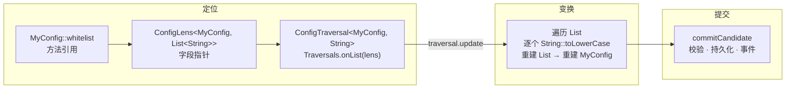

### 10.8.4 提交阶段的职责

`commitCandidate` 是整个流程的收束点：

```java
T commitCandidate(T previous, T candidate, boolean persist) {
    validateValueOrThrow(candidate);        // 1. 校验所有字段
    if (!Objects.equals(candidate, previous)) {
        setValue(candidate);                // 2. 更新内存值 + 发布事件
    }
    if (persist) {
        writeToDisk(candidate);             // 3. 写入磁盘
    }
    lastValidValue = candidate;             // 4. 记录最后有效值（用于回滚）
    return candidate;
}
```

无论上层操作多么不同（单个字段更新、条件更新、批量更新、多个 Mutation），最终都汇聚到同一个 `commitCandidate` 方法，确保**校验、事件、持久化的一致性**。

---

## 10.9 设计权衡

### 10.9.1 自研而非使用 DFU Optics

Mojang 的 DataFixerUpper 内部提供了一套 Profunctor Optics，但它深度绑定了 DFU 的 Kind 系统（`App`、`App2`、`K1`、`K2`、`Applicative`），可读性差且依赖重。OELib 选择纯手工实现精简版的 Lens、Affine、Traversal、Fold，仅保留对 DFU `Dynamic` 的依赖用于配置迁移。

### 10.9.2 克制：只实现配置库需要的

没有实现 `Iso`、`Getter`、`Setter`、`Grate` 等更高级的光学类型。只聚焦三个核心场景：**聚焦特定字段**、**条件可选访问**、**集合批量遍历**。这些概念被完好地隐藏在了 `ConfigUnit` 面向业务的 API 之下。

---

## 10.10 回顾：从业务 API 到底层 Optics

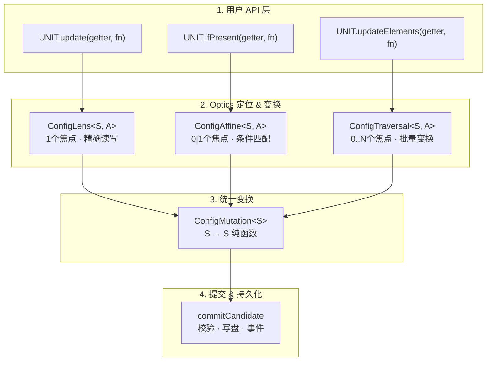

每一层各司其职：

- `RecordLensBuilder` 通过字节码生成，将方法引用零反射地转化为 Lens
- Lens / Affine / Traversal / Fold 各自处理不同"焦点数"的数据定位需求
- `ConfigMutation` 将复杂的变换坍缩为 `S -> S` 纯函数，与 IO 完全解耦
- `ConfigUnit.commitCandidate` 兜底处理校验、持久化、事件通知

用户只需写出 `UNIT.update(MyConfig::port, v -> v + 1)`，就能享受到**绝对类型安全、不可变数据结构、零反射高性能**的字段级更新。
