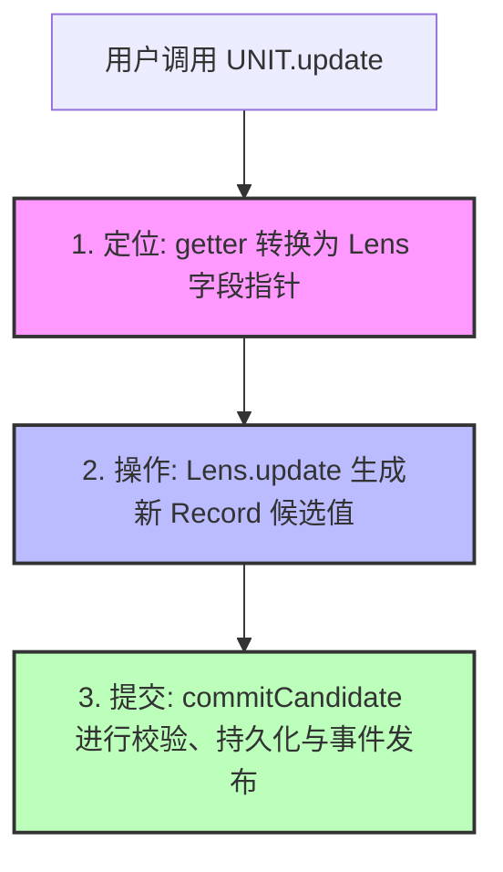
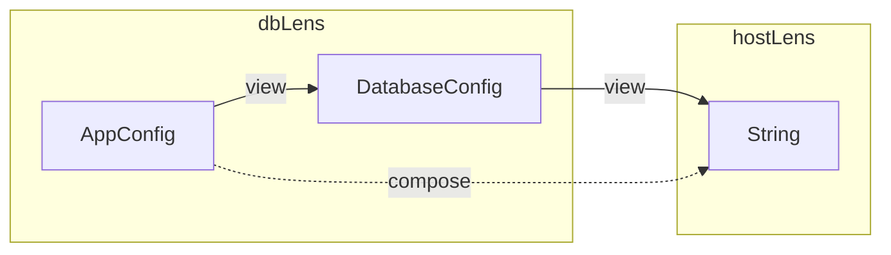
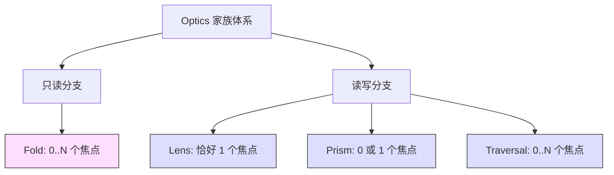
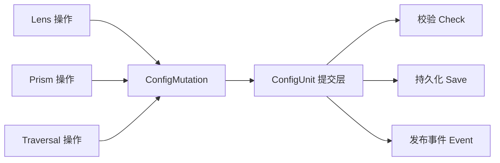
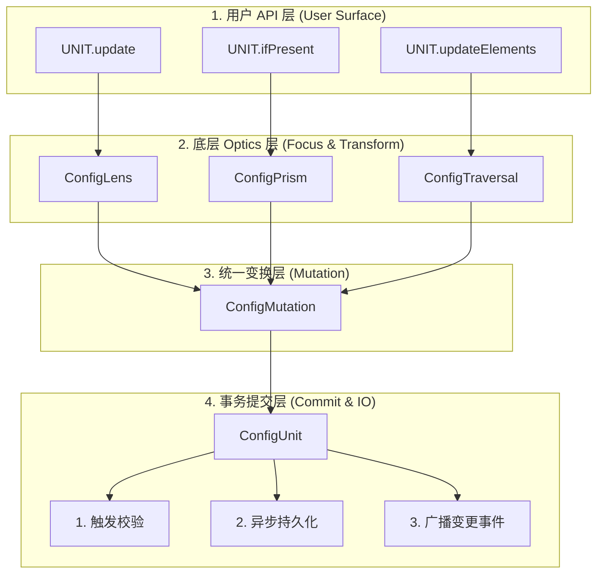

# Chapter 10: Optics 架构揭秘

> 本章涉及光学（Optics）理论的基本概念。如果你此前没有接触过函数式编程中的 Lens、Prism 等概念，阅读起来可能会有一定困难。
> 我们建议有兴趣深入了解的读者先学习真正的光学理论，例如：
> - [Monocle](https://www.optics.dev/Monocle/)（Scala optics 库，文档详尽）
> - [higher-kinded-j](https://github.com/higher-kinded-j/higher-kinded-j/tree/main/hkj-book)（Java optics 库，有配套书籍）
> - [Profunctor Optics: Modular Data Accessors](https://research-information.bris.ac.uk/en/publications/profunctor-optics-modular-data-accessors)（原理论文）
>
> 如果你只是想用 OELib Config 来管理配置文件，完全不需要阅读本章——前九章已经覆盖了全部日常使用场景。

前九章你一直在使用 `update`、`ifPresent`、`updateElements` 这些 API。它们工作得不错，但你有没有想过：为什么 `update(MyConfig::port, v -> v + 1)` 能精确修改 Record 中的某个字段，而不影响其他字段？为什么 `ifPresent` 能在值为空时自动跳过？

这些 API 的背后是一套 **Optics（光学）** 体系。本章将揭示它们是什么、如何工作、以及为什么选择这样的设计。

---

## 10.1 你一直在用 Optics

从第 5 章开始的每一次修改，表面上是简单的业务 API 调用，背后其实都是 Optics 在驱动。

以下是用户视角与系统内部执行视角的对比：

```java
// 用户看到的是：
UNIT.update(MyConfig::port, v -> v + 1);

```



第 6 章的 `ifPresent`：

```java
UNIT.ifPresent(MyConfig::maxPlayers, v -> v + 1);
// 内部：getter → Lens → Prism（条件包装）→ updateIfPresent → commitCandidate

```

第 7 章的 `updateElements`：

```java
UNIT.updateElements(MyConfig::whitelist, String::toLowerCase);
// 内部：getter → Lens → Traversal（集合包装）→ update → commitCandidate

```

> **核心设计理念**
> 每个业务 API 的背后都是不变的 Optics 三部曲：**定位 → 操作 → 提交**。
> * **定位** 这一步由 `Lens`、`Prism`、`Traversal` 精确完成。
> * **操作** 和 **提交** 由 `ConfigUnit` 统一拦截并管理。
>
>

---

## 10.2 Lens：字段指针

`ConfigLens<S, A>` 是 Optics 体系中最基础的构成单元。它描述了“如何从源类型 `S` 中读取属性 `A`，以及如何将新的 `A` 写回 `S`”。

```java
public final class ConfigLens<S, A> {
    private final Function<S, A> viewFn;       // S → A
    private final BiFunction<A, S, S> setFn;   // (A, S) → S

    public A view(S source) { return viewFn.apply(source); }
    public S set(S source, A value) { return setFn.apply(value, source); }
    public S update(S source, UnaryOperator<A> updater) {
        return setFn.apply(updater.apply(viewFn.apply(source)), source);
    }
}

```

简单来说，**Lens 就是一个打包在一起的 getter + setter 对**。这里没有任何黑魔法。

### Lens 的创建方式

通常通过 `RecordLensBuilder.lens()` 从方法引用（getter）中自动创建：

```java
// 通过 RecordLensBuilder.lens() 从 getter 创建
ConfigLens<MyConfig, Integer> portLens =
        RecordLensBuilder.lens(MyConfig.class, MyConfig::port);

```

`RecordLensBuilder` 会从 getter 方法引用中提取字段名，并通过 `RecordLensClassGenerator` 在运行时生成隐藏类——使用 `invokevirtual` 读取、`invokespecial`（调用 Record 构造函数）写入，**完全无需传统的反射，保证了极致的性能**。

### Compose：字段指针的组合

Lens 的核心价值在于 **Compose（组合）**。两个 Lens 可以组合成一个全新的 Lens，从而具备**直通嵌套字段**的能力：

```java
ConfigLens<AppConfig, DatabaseConfig> dbLens =
        RecordLensBuilder.lens(AppConfig.class, AppConfig::database);
ConfigLens<DatabaseConfig, String> hostLens =
        RecordLensBuilder.lens(DatabaseConfig.class, DatabaseConfig::host);

// 组合后：直通 AppConfig.database.host
ConfigLens<AppConfig, String> dbHostLens = dbLens.compose(hostLens);

```



组合 Lens 的 `set` 操作采用**从内向外逐层重建**的机制：

1. 先用 `hostLens` 替换 `DatabaseConfig` 中的 `host`，生成新的 `DatabaseConfig`。
2. 再用 `dbLens` 将这个新的 `DatabaseConfig` 替换回 `AppConfig` 中。

在此期间，中间层的 Record 虽然被重建，但其未改变的值以及无关字段完全不受影响。

### 类型推演链

```text
dbLens:     AppConfig → DatabaseConfig
hostLens:              DatabaseConfig → String
─────────────────────────────────────────────
compose:    AppConfig ───────────────→ String

```

> **注意：** 组合时中间类型必须绝对匹配。即 `hostLens` 的源类型（`DatabaseConfig`）必须等于 `dbLens` 的目标类型，这一约束在编译时由 Java 泛型进行严格检查。

---

## 10.3 Prism：条件字段访问器

`ConfigPrism<S, A>` 可以理解为**可能失败的 Lens**——它不一定能成功匹配或定位到目标值。

```java
public final class ConfigPrism<S, A> {
    private final Function<S, Optional<A>> preview;  // S → Optional<A>
    private final BiFunction<A, S, S> setter;        // (A, S) → S
}

```

### 创建方式

1. **从 Optional 字段创建：**
```java
ConfigLens<MyConfig, Optional<Integer>> optLens = ...;
ConfigPrism<MyConfig, Integer> prism = RecordLensBuilder.optional(optLens);

```


2. **从密封类型的子类型（Sealed Subtypes）创建：**
```java
ConfigPrism<MyConfig, ModeA> aPrism =
        RecordLensBuilder.subtype(modeLens, ModeA.class);

```


### Lens 与 Prism 的核心操作对比

| 操作 | Lens | Prism |
| --- | --- | --- |
| **读取** | `view(S)` → 总是返回 `A` | `preview(S)` → 返回 `Optional<A>` |
| **写入** | `set(S, A)` → 总是成功 | `set(S, A)` → 不匹配时行为未定义（通常跳过） |
| **条件写入** | 无 | `updateIfPresent(S, f)` → **只有匹配时**才执行变换 |

* **Compose 规则：** `Lens + Prism = Prism`。因为 Lens 只能保证外层目标存在，但一旦引入了可能失败的 Prism，组合后的最终结果便引入了不确定性。

---

## 10.4 Traversal 和 Fold：集合遍历

`ConfigTraversal<S, A>` 描述了如何**同时聚焦集合（如 List、Map）中的零到多个元素**。

```java
public final class ConfigTraversal<S, A> extends ConfigFold<S, A> {
    private final BiFunction<S, UnaryOperator<A>, S> updateAll;
}

```

### 创建方式

```java
// List 元素遍历
ConfigTraversal<MyConfig, String> t =
        Traversals.onList(RecordLensBuilder.lens(MyConfig.class, MyConfig::names));

// Map 值遍历
ConfigTraversal<MyConfig, Integer> v =
        Traversals.onMapValues(RecordLensBuilder.lens(MyConfig.class, MyConfig::limits));

```

`ConfigFold<S, A>` 是 Traversal 的**只读版本**——它只暴露出提取操作，而不允许进行更新。系统中的 `count`、`anyMatch`、`allMatch`、`getAll` 等业务 API，底层全部由 `ConfigFold` 驱动。

### Compose 组合规则

| 组合方式 | 结果类型 | 核心原因 |
| --- | --- | --- |
| `Traversal + Lens` | **Traversal** | 对集合中的每一个元素，进一步提取其子字段 |
| `Traversal + Traversal` | **Traversal** | 展开两层嵌套集合（多维集合遍历） |
| `Traversal compose Lens` | **Traversal** | Lens 不会改变元素数量，依旧保持多焦点性质 |
| `Lens compose Traversal` | **Traversal** | 先由 Lens 定位到集合字段，再由 Traversal 展开多焦点 |

---

## 10.5 类型映射与组合规则

我们可以将这四种 Optics 类型抽象为“不同形态的类型映射”：

| Optic 类型 | 映射机制 | 焦点数量 | 能力 |
| --- | --- | --- | --- |
| **Lens** | `S → A` | **恰好一个** | 读写 |
| **Prism** | `S ⇢ A` | **零个或一个** | 读写（可能跳过） |
| **Traversal** | `S ↠ A` | **零个或多个** | 读写（批量） |
| **Fold** | `S ⇢ A` | **零个或多个** | **只读** |



组合后的最终形态，完全由**焦点数量的乘积**决定，其背后的数学基础非常直观：

* `Lens (1) + Lens (1) = Lens (1)` *(1 × 1 = 1)*
* `Lens (1) + Prism (0\|1) = Prism (0\|1)` *(1 × (0|1) = 0|1)*
* `Prism (0\|1) + Lens (1) = Prism (0\|1)` *((0|1) × 1 = 0|1)*
* `Traversal (0..n) + Lens (1) = Traversal (0..n)` *(0..n × 1 = 0..n)*
* `Traversal (0..n) + Traversal (0..n) = Traversal (0..n)` *(0..n × 0..n = 0..n)*

> 不需要理解复杂的范畴论。你只需要记住：**组合后的焦点数量等于各组件焦点数量相乘**。

---

## 10.6 Mutation：统一提交

无论你在上层使用的是哪一种 Optics，它们的变换请求最终都会收敛、坍缩为统一的 `ConfigMutation` 结构：

```text
Lens.setTo(value) / Lens.map(fn)         ──→ ConfigMutation<S>
Prism.updateIfPresent (内部委托)          ──→ ConfigMutation<S>
Traversal.toMutation(fn)                 ──→ ConfigMutation<S>

```

`ConfigMutation<S>` 在本质上是一个简单的 `S → S` 函数。它**只负责描述“如何将旧配置变换为新配置”，而完全不关心“何时提交”或“如何持久化”**。当用户调用 `updateAll` 时，多个 mutation 会被打包在一起，交由底层的事务机制一次性提交。



这就是 Optics 层与持久化层之间清晰的**解耦边界**：Optics 负责纯粹的**定位与数据变换**，而 `ConfigUnit` 则负责**校验、生命周期维护与持久化落地**。

---

## 10.7 设计权衡

OELib Config 在落地这套 Optics 体系时，为了实用性做出了两项关键的工程取舍：

### 取舍一：不依赖 DFU 的原生 Optics 体系

Mojang 的 DFU (DataFixerUpper) 内部提供了一套极其完整的 Profunctor Optics 实现。然而，它深度绑定了 DFU 晦涩的 Kind 系统（如 `App`、`App2`、`K1`、`K2`、`Applicative`），这不仅使代码可读性极差，还会引入沉重的依赖代价。

因此，OELib 选择**纯手工实现精简版的 Lens、Prism、Traversal 和 Fold**，仅保留对 DFU `Dynamic` 的依赖用作配置迁移与序列化。

### 取舍二：克制的非完备光学库

我们并没有追求学术上的完美，因此没有去实现 `Iso`（等构）、`Getter`、`Setter`、`Grate`、`Affine` 等更高级的光学类型，也没有引入 Free Monad DSL 或复杂的注解处理器。

OELib 只聚焦于满足配置库最核心的三个场景：**聚焦特定字段**、**条件可选访问**和**集合批量遍历**。并将这些复杂的概念完好地隐藏在了 `ConfigUnit` 面向业务的 API 之下。

> **对开发者的启示**
> 如果你熟悉 Scala 的 Monocle 或 Kotlin 的 Arrow，你会发现这里的实现有些简陋。
> 但如果你只是想在 Minecraft Mod 里面写一个优雅的配置文件，你根本不需要懂这些——你只需要快乐地调用 `UNIT.update(getter, modifier)`。

---

## 10.8 回顾：从业务 API 到底层 optics

最后，让我们通过一张完整的架构映射表与分层图，理清从代码表面到底层实现的全部脉络：

| 用户面向的业务 API | 底层驱动的 Optics 组件 | 内部行为 | 最终提交层 |
| --- | --- | --- | --- |
| `UNIT.update(g, m)` | `ConfigLens` | `compose` → `view`/`set` | `ConfigMutation` → `commitCandidate` |
| `UNIT.ifPresent(g, m)` | `ConfigPrism` | `optional`/`subtype` 匹配 | `ConfigMutation` → `commitCandidate` |
| `UNIT.updateElements(g, m)` | `ConfigTraversal` | `Traversals.onList` → 批量更新 | `ConfigMutation` → `commitCandidate` |
| `UNIT.updateValues(g, m)` | `ConfigTraversal` | `Traversals.onMapValues` → 批量更新 | `ConfigMutation` → `commitCandidate` |
| `UNIT.count(g)` | `ConfigFold` | `extract` 数据提取 | `get()` 直接返回，**无 mutation** |
| `UNIT.updateAll(m1, m2)` | — | 组合多个 Mutation | `ConfigMutation[]` → `commitCandidate` |



通过这一层层各司其职的严密结构：

* `RecordLensBuilder` 负责利用高性能字节码从 getter 织入 Lens。
* 各类 `Optic` 负责进行类型安全的定位与数据结构重组。
* `ConfigMutation` 将复杂的改动坍缩为最纯粹的函数变换。
* `ConfigUnit` 兜底处理现实世界中的校验、IO 与事件通知。

用户无需感知复杂的范畴论或光学概念，就能享受到**绝对类型安全、不可变数据结构、以及极高工程可维护性**带来的红利。这正是这套 Optics 架构设计的魅力所在。